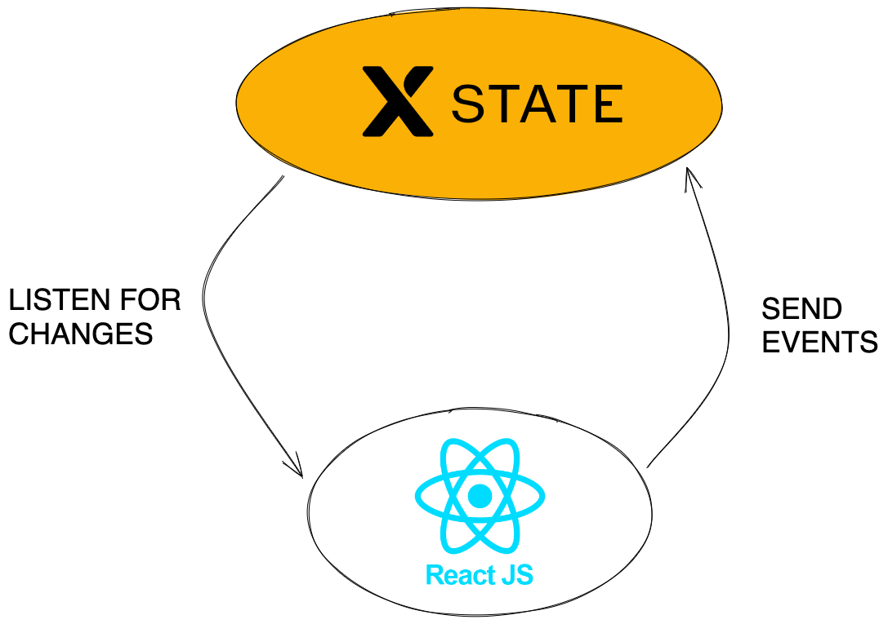

<!-- slide -->

<!-- slide -->

## Gestionnaires d'états

<!-- slide -->

## `whoami`

- Maxime Blanc
- Techlead Core TVJS

<!-- slide -->

# Projet XState

> Se convaincre que n < 2n

<!-- slide -->

## Qu'est ce qu'un état ?

> L'ensemble des caractéristiques d'un système à un moment donné

<!-- slide -->

## Comment représenter un état ?

<!-- slide -->

## Machine à états finis

- Un nombre fini d'**états**
- Un nombre fini d'**événements**
- Un **état initial**
- Une fonction de transition tel que
  `STATE + EVENT => NEW STATE`

<!-- slide -->

<!-- slide -->

> n < 2n
