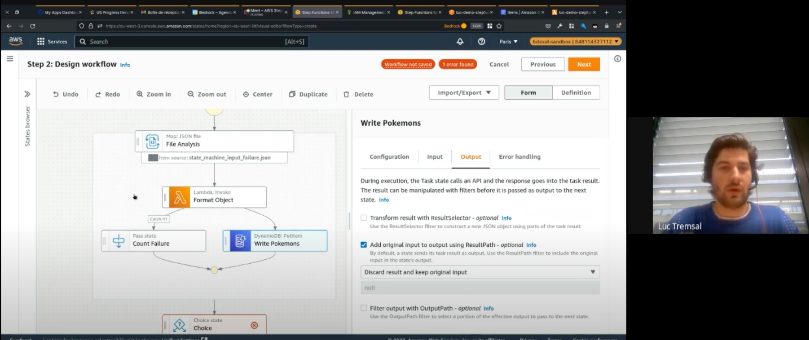
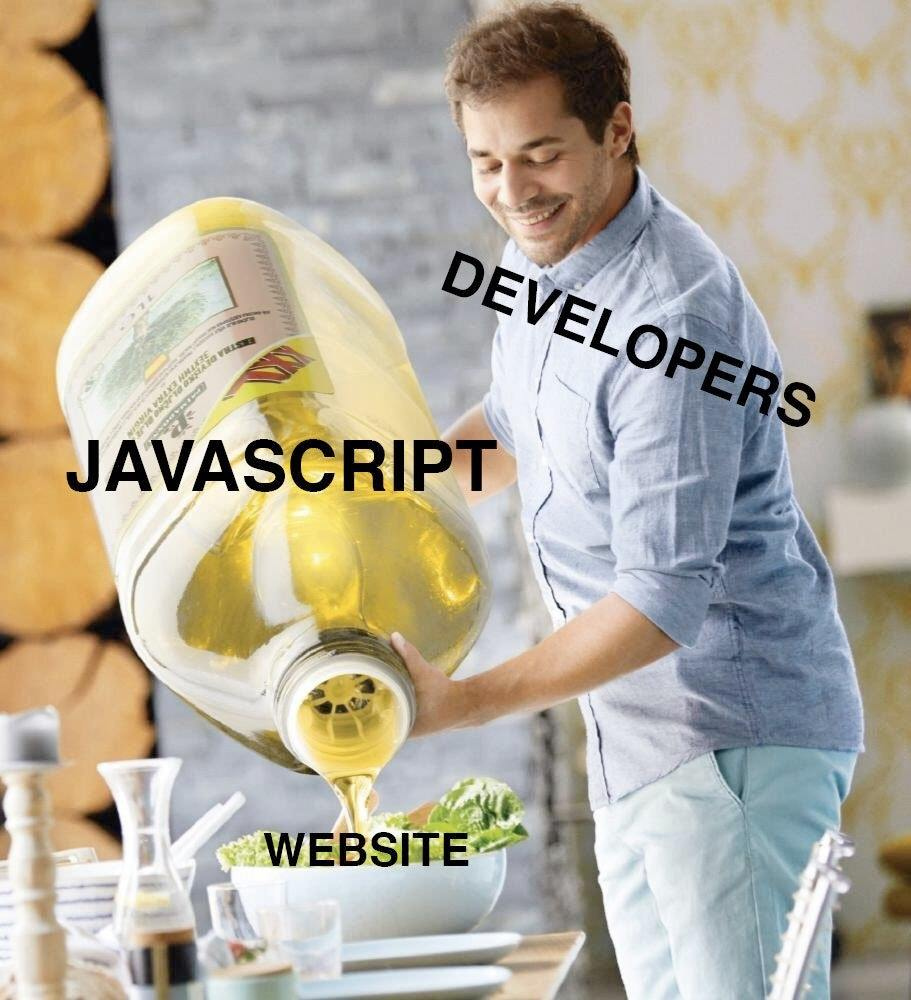

<!-- slide -->

<!-- slide -->

<!-- slide -->

Migration **Fluxible** vers **Redux**

<!-- slide -->

## Gestionnaires d'états

<!-- slide -->

<!-- slide -->

## `whoami`

> Maxime Blanc
> Techlead Core TVJS

<!-- slide -->

# Projet XState

> Retrouver le contrôle de son application grâce à la formule :
> n < 2n

<!-- slide -->

## Machine à état avec AWS : Les steps functions

<!-- slide -->

## Qu'est ce qu'un état ?

> La combinaison de l'ensemble des caractéristiques d'un système, à un moment donné

<!-- slide -->

## Comment représenter un état ?

> Démo n°1

<!-- slide -->

## Machine à états finis

- Un **état initial**
- Un nombre fini d'**états**
- Un nombre fini d'**événements**
- Une fonction de transition tel que
  `STATE + EVENT => NEW STATE`

<!-- slide -->

> Démo n°2

<!-- slide -->

## Résumé

- Transition d'état suite à un événement
- Transition d'état après une durée
- État composé
- État parallèle
- Gestion des effets de bord avec **les actions**
- Persister une valeur avec **le contexte**

<!-- slide -->

## Des questions ?

Non, on n'aura pas le temps

<!-- slide -->

> As-tu regardé le poids d'XState sur bundlephobia ?   **Un certain Antoine.C**

<!-- slide -->

<!-- slide -->

<!-- slide -->

## Robot3 : Les machines à états 0%MG

<!-- slide -->

## Peu importe la librairie

> n < 2n, c'est déjà un début

<!-- slide -->

## Le choix final vous appartient
